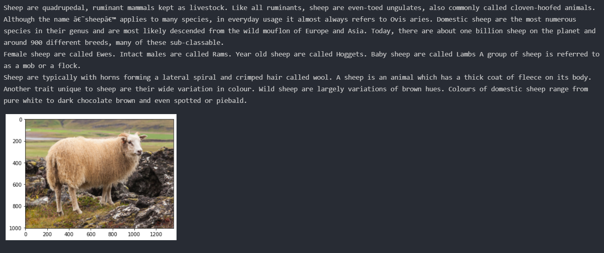

# Animals detection using CNN
> Animal detection using convolutional neural network (CNN) with tensorflow, there are 10 categories of animals. The program predicts the animal and displays a description about it.

# Screenshots

# Requirements
- [x] Python
- [x] TensorFlow
- [x] OpenCV
- [x] Matplotlib
